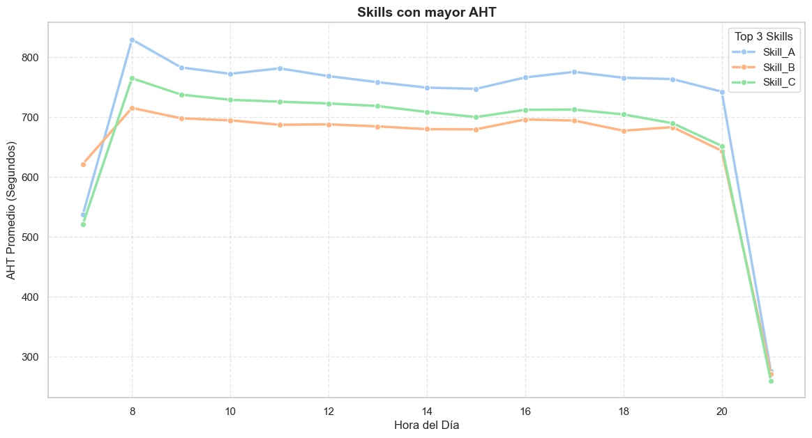
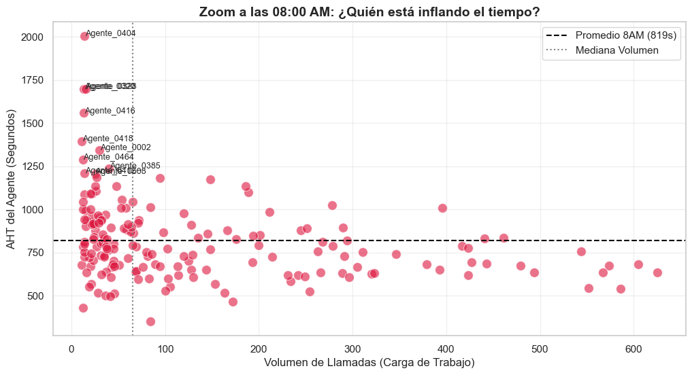
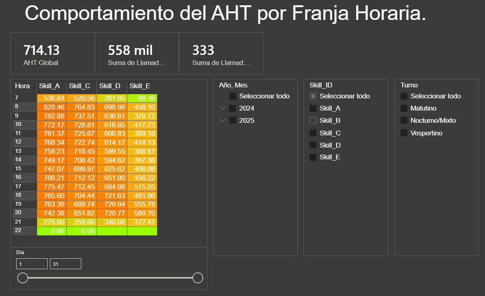
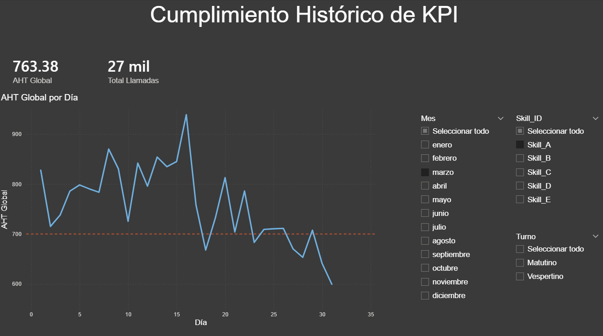

___
# 📞 Contact Center Operations Optimization: AHT & Efficiency Analysis
___


## 📖 Descripción del Proyecto

Este proyecto aborda un problema crítico en la operación de un Contact Center: **la variabilidad ineficiente del Tiempo Promedio de Operación (AHT)**.

Utilizando datos reales (anonimizados) de operaciones diarias, se desarrolló un pipeline de datos (ETL) en Python para limpiar reportes operativos crudos, proteger información sensible y generar insights estratégicos. 

El resultado final alimenta un dashboard en Power BI que permite a la gerencia identificar cuellos de botella por franja horaria y brechas de capacitación en agentes específicos.

**Problema Resuelto:**

La operación presentaba picos de ineficiencia desconocidos que afectaban el Nivel de Servicio. 

El análisis reveló que el problema no era sistémico, sino concentrado en **franjas horarias específicas (08:00 AM)** y en un **pequeño porcentaje de agentes (outliers)<**.

---

## 🚀 Características Clave (Key Features)

* **🛡️ Protección de Datos:** Script de anonimización robusto que enmascara nombres de agentes y IDs sensibles manteniendo la integridad referencial entre tablas.
* **🧹 Limpieza de Datos Operativos:** Transformación de reportes "sucios" de Excel (formatos mixtos, filas basura, metadatos) en datasets analíticos limpios.
* **⏰ Feature Engineering Intradía:** Extracción y categorización de franjas horarias y turnos para análisis de mapas de calor (Heatmaps).
* **📊 Business Intelligence:** Identificación de patrones de comportamiento por Skill y Agente, calculando el impacto financiero de la re-capacitación focalizada.

---

## 🛠️ Tecnologías Utilizadas

* **Lenguaje:** Python 3.10
* **Librerías:**
    * `Pandas` & `NumPy`: Manipulación de datos y cálculos vectorizados de KPIs.
    * `Seaborn` & `Matplotlib`: Análisis Exploratorio de Datos (EDA) y visualización estadística.
    * `OpenPyXL`: Lectura de archivos Excel complejos.
* **Visualización:** Microsoft Power BI (DAX para medidas dinámicas).
* **Control de Versiones:** Git & GitHub.

---

## 📂 Estructura del Proyecto

```text
├── data/
│   ├── raw/           # (Ignorado por git) Archivos originales crudos y confidenciales.
│   └── processed/     # CSVs limpios, anonimizados y listos para el dashboard.
│
├── notebooks/
│   ├── 01_ETL_Anonimizacion.ipynb  # Script principal de limpieza y transformación.
│   └── 02_EDA_Insights.ipynb       # Análisis exploratorio y gráficos estadísticos.
│
├── dashboard/
│   └── Dashboard_Operativo.pbix    # Archivo de Power BI.
│
├── img/               # Capturas de pantalla para este README.
│
├── requirements.txt   # Dependencias del proyecto.
└── README.md          # Documentación del proyecto.

```

---

## ⚙️ Instrucciones de Instalación

1. **Clonar el repositorio:**
```bash
git clone [https://github.com/tu-usuario/contact-center-optimization.git](https://github.com/tu-usuario/contact-center-optimization.git)
cd contact-center-optimization

```


2. **Crear un entorno virtual (Recomendado):**
```bash
python -m venv venv
source venv/bin/activate  # En Windows: venv\Scripts\activate

```


3. **Instalar dependencias:**
```bash
pip install -r requirements.txt

```


4. **Ejecutar el Pipeline:**
* Abre `notebooks/01_ETL_.ipynb` en Jupyter Lab o VS Code.
* Ejecuta las celdas para procesar los datos crudos y generar los archivos en `data/processed/`.


---

## 📈 Análisis e Insights

### 1. El "Infarto" de las 08:00 AM

El análisis intradía reveló que el AHT se dispara un **60% por encima del promedio** únicamente a las 8:00 AM, estabilizándose después.



### 2. Detección de Outliers (Scatter Plot)

Se identificó que el aumento del AHT no es generalizado. Un grupo reducido de agentes (puntos rojos) excede los 1000 segundos consistentemente, mientras el grueso de la operación se mantiene en meta.



---

## 📊 Dashboard en Power BI

El archivo `.pbix` conecta con los datos procesados para ofrecer una vista gerencial interactiva.

**Métricas DAX Clave:**

```dax
AHT Global = DIVIDE([Tiempo Total Operacion], [Total Llamadas], 0)

```






---

## 🤝 Contribución

¡Las sugerencias son bienvenidas! Si deseas mejorar el pipeline de limpieza o agregar nuevos visuales:

1. Haz un Fork del proyecto.
2. Crea una rama para tu feature (`git checkout -b feature/NuevaAnalitica`).
3. Haz Commit de tus cambios (`git commit -m 'Agregado análisis de adherencia'`).
4. Haz Push a la rama (`git push origin feature/NuevaAnalitica`).
5. Abre un Pull Request.

---

## 📄 Licencia

Este proyecto está bajo la Licencia MIT - ver el archivo [LICENSE.md](LICENSE.md) para más detalles.

---

## 📧 Contacto & Créditos

**Desarrollado por:** [Ivan MF]

* 💼 LinkedIn: [ivanmf888](https://www.linkedin.com/in/ivanmf888/)
* 📧 Email: [ivantisouls4@gmail.com]
* 🐈 GitHub: [IvanFM888](https://github.com/IvanFM888)


```